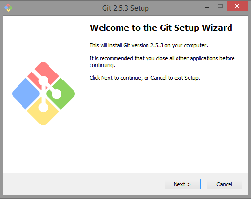
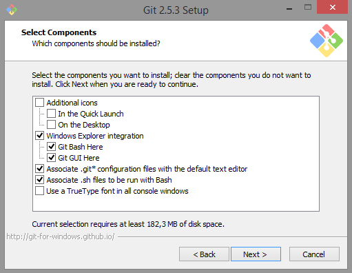
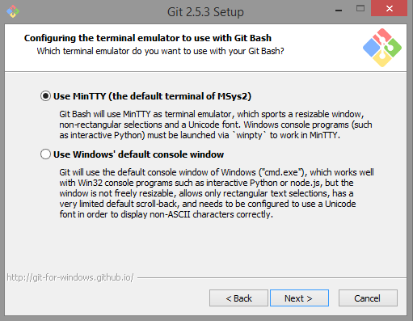

# Capítulo 2: Instalação e Configuração
Jhenifer  
29/10/2015  

## Instalação:

#### Windows
Usuários Windows devem visitar [Git for Windows](https://git-for-windows.github.io/ "Git"), clicar em "Download" e baixar o arquivo ".exe".

Após o download, execute o arquivo e você terá essa tela: 

Como de costume, clice em "Next". Para dar continuidade a instalação aceite a licença do Git.

O diretório apresentado na figura a baixo vem como default, porém é possível alterar a instalação para um diretório de sua preferência. Depois de selecionado o caminho da instalação, clique em "Next" para prosseguir.

Na tela de componentes podemos definir atalhos, integração ao menu de contexto do Windows Explorer, associação de arquivos e uso de font TrueType. O Git Bash é o prompt de comandos próprio, que além dos comandos Git também fornece alguns comandos Unix que podem ser bem úteis. E o Git GUI que é uma interface para trabalhar com Git. É recomendável a seleção de ambos os itens. Depois de selecionado os componentes de sua preferência, dê continuidade.

Aqui, o instalador nos oferece a oportunidade de mudar o nome da pasta no menu iniciar, recomenda-se deixar o padrão para fácil localização posteriormente.

Na tela de configuração "PATH environment", podemos escolher as formas de integração do Git em nosso sistema. 

A primeira opção nos permite usar o Git apenas pelo "Git Bash" (é o prompt de comando do Git), a segunda opção nos possibilita executar os comandos no "Git Bash"" e no prompt de comando do Windows (cmd.exe), e a terceira opção é a junção das duas de cima, porém alguns comandos do Windows serão substituídos por comandos Unix com mesmo nome.
Essa última opção não é recomendada, portanto a primeira opção é a desejável. 

 Abaixo, a configuração de quebra de linha. Windows e sistemas Unix (Linux, Mac) possuem formatos diferentes de quebra de linha em arquivos de texto. Se você escreve um código com quebras de linha no formato Windows, outra pessoa pode ter problemas ao abrir o mesmo arquivo em um Linux, e vice-versa. Esta opção, portanto, permite normalizar isso. 

A primeira opção converte automaticamente os arquivos para padrão Windows quando receber algum arquivo e converterá para padrão Unix quando “comitar” (enviar alterações) no repositório. A segunda opção, não faz nenhuma conversão ao receber arquivos, mas convertem para padrão Unix ao “comitar”. Já a terceira opção, o Git não fará nenhuma conversão. 

 Recomenda-se a seleção da opção "Checkout Windows-style, commit Unix-Style line endings".

Aqui, a configuração do emulador de terminal para usar com o Git Bash.

A primeira opção utiliza o terminal MSys2 (Shell), que permite utilizar comandos Unix no Windows. E a segunda opção, utiliza o terminal padrão do Windows. A melhor opção é a primeira. Feito isso, dê continuidade a instalação.

E por último, configurando ajustes de performance. Essa opção é para habilitar o sistema de cache de arquivo.

Feito isso, “Next”, “Finish” e o Git está instalado.

#### Linux

#### MacOS

## Configurando Perfil
- Comandos necessários para configurar nome de usuáro e email.
