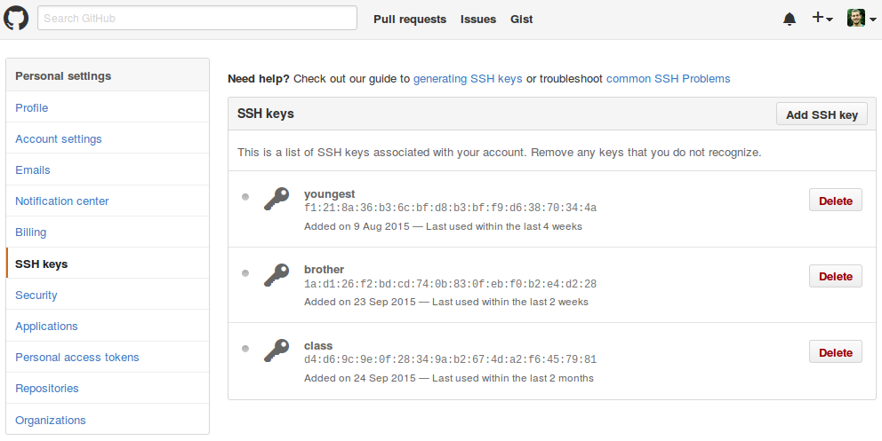
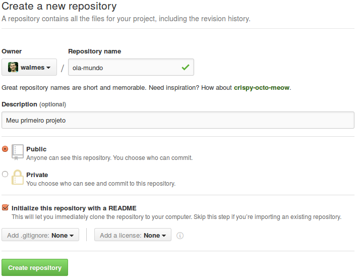
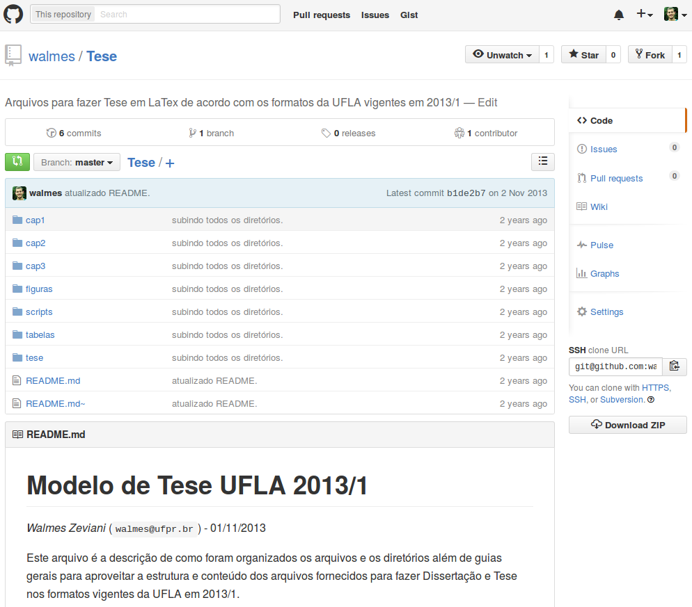

```{r, include=FALSE}
library(knitr)
opts_chunk$set(comment=NA)
```

## Serviços Web para Git ##

No capítulo anterior vimos como configurar um repositório remoto em um
servidor. Esse procedimento possibilita trabalho em equipe visto que
todos com acesso à servidora, então podem clonar, subir ramos, etc.
Apesar do servidor centralizar as contribuições de todos os usuários,
estes terão que se comunicar e manter os compromissos sobre o projeto em
de outra forma, por email direto, lista de email, lista de
discussão. Para que um desenvolvedor saiba o que os outros fizeram, ele
terá que periodicamente dar `fetch`, navegar no histórico, ver *diffs*,
etc.

O Git tem muitos serviços web voltados justamente para ter um local que
centralize o projeto bem como ofereça recursos administrativos e
colaborativos. Esses serviços possuem contas *free* etc...

O objetivo desse capítulo é apresentar os serviços web para repositórios
Git, descrever suas principais características, indicar como criar e
configurar uma conta ligada a um repositório local. Além disso, o
*workflow* básico que considera servições web será descrito, enfatizando
as funcinalides desses serviçõs voltados à colaboração.

### GitHub ###


O [GitHub] é um serviço Web para hospedagem, gestão e compartilhamento
de repositórios Git que oferece recursos para desenvolvimento e
colaboração. A principal slogam do GitHub é: *"Build software better,
together."* que justamente enfatiza o compromisso principal que é dar
suporte ao desenvolvimento colaborativo.

O GitHub foi fundado em 8 de Fevereiro de 2008, em São Francisco, por
quatro pessoas: Tom Preston-Werner, Chris Wanstrath, PJ Hyett e Scott
Chacon. Antes de terminar 2015, o GitHub já ultrapassou a marca de 10
milhões de usuários. De acordo com o <http://githut.info/>, no quarto
trimestre de 2014 haviam 22 milhões de repositórios. A linguagem
`JavaScript` teve o maior número de repositórios ativos (>320 mil) e
total de *pushes* enquanto que a linguagem `R` foi a com maior número de
novas cópias por repositório (6.45).

Diferente da forma tradicional de usar o Git, por linha de comando, que
fizemos até agora, o GitHub é um serviço web com interface gráfica
repleta de funções para o desenvolvimento e acompanhamento de um projeto
Git. Tais recursos vão desde administrar tarefas até a permitir a
colaboração de outras pessoas, até mesmo desconhecidos. Dentre os
principais recursos disponíveis, tem-se:

  * README: é um arquivo texto escrito em liguagem de marcação
    (Markdown, RST, Textile, Org, etc) que é renderizada para
    exibição. O README é a capa do seu repositório, ou seja, o conteúdo
    apresentado na *home* do projeto e serve para informar o visitante
    dos objetivos do repositório, seus desenvolvedores e pode conter
    instruções de instalação e colaboração.
  * Wiki: a Wiki de cada repositório serve para divulgação e
    documentação. Também é escrita em linguagem de marcação, tornando
    fácil e rápido a escrita pelo desenvolvedor e simples a leitura e a
    navegação pelo visitante. Como a Wiki é também um repositório Git,
    ela pode inclusive ser editada por meios dos recursos de edição do
    prórpio GitHub, além de versionada, claro. Com isso, não diferente
    do restante, a edição da Wiki também é colaborativa.
  * *Issues*: Por *issues* é que se faz a correção de bugs e agendamento
    de tarefas. Usuários criam *issues* para notificar um bug encontrado
    de forma que ele possa ser rapidamente corrigido. Criar *issues*
    também serve como ferramenta de admistração de tarefas nas quais os
    *issues* descrevem algo a ser feito e por quem.
  * *Milestones*: são pedras de milha, ou seja, marcam um ponto a ser
    alcançado. No GitHub, são usadas para descrever o que precisa ser
    desenvolvido para que ocorra uma mundança de versão e estabalecer um
    prazo para conclusão, por exemplo.
  * *Pull request* ou *merge request* (MR): é uma requisição de
    fusão. Os membros da equipe fazem suas contribuições em ramos de
    desenvolvimento e ao concluir pedem um MR pela interface. O
    responsável por avaliar o MR pode ver os *diffs* nos arquivos e
    fazer o merge direto pela interfaçe, de dentro do serviço sem
    precisar baixar o ramo, aplicar o merge e subí-lo.
  * *Fork*: é uma forma de se fazer uma cópia do projeto de alguém para
    livremente experimentar modificações sem afetar o projeto
    original. A cópia vem para a sua conta e funciona como qualquer
    outro repositório seu. A ideia do *fork* é dar liberdade de
    contribuição (não supervisionada) a qualquer pessoa interessada de
    modo que esta possa submeter as contribuições para a origem (por MR)
    ou até mesmo usar como ponto de partida para um projeto.

De acordo com [Klint Finley], *fork* e MR são o que tornam o GitHub tão
poderoso. Quando o mantenedor recebe um MR ele pode ver o perfil do
contribuidor onde estão listados todos os projetos no qual este deu
contribuição. Ao aceitar o MR, é acrescentado mais uma colaboração a
reputação do colaborador. Esse mecanísmo, então, beneficia as duas
partes.

Além dessas características chaves, o GitHub permite que você acompanhe
(*watch*) e favorite (*star*) repositórios. Também dá para seguir
pessoas e participar de organizações (grupo de usuários) que podem ter
repositórios próprios, ideal para projetos em equipe. O perfil de cada
usuário registra suas atividades e dentro de cada projeto pode-se
acompanhar as contribuições de cada colaborador. Em cada repositório
pode-se navegar pelo histórico de *commits*, filtrar por colaborador,
ver as modificações no código (*diffs*) comaprando *commits* e
*branches*.

O GitHub não hospeda apenas código fonte mas sim todo e qualquer arquivo
que você tenha sob versionamento. É possível hospedar dados, por
exemplo, em formato texto (csv), e disponibilizá-los por meio da URL
para download ou leitura direta. Para nós que somos usuários de R, essa
é uma característica que permite não só disponibilizar dados, mas também
coleções de funções que podem ser carregadas com um `source()`.

Com o plano *free* do GitHub, você pode ter inúmeros repositórios
públicos e inúmeros colaboradores, pode ter o *fork* de quantos
repositórios quiser e participar de quantas organizações precisar. Para
ter repositórios privados, o plano mais básico custa U$ 7 e dá direito a
5 repositórios. Existem outros planos individuais, e também planos
organizacionais, para todos os tamanhos de projeto e equipe. Além dessas
formas, pode-se ter o GitHub em um servidor próprio, o
[GitHub Interprise], que tem vantagens além das já mencionadas, no
entanto, tal como qualquer plano privado, tem seu custo.

É uma fonte de conhecimento onde você encontra *scripts* nas mais
diferentes linguagens de programação. Você pode livremente estudar o
código dos repositórios, ver como o código evoluiu *commit* após
*commit* e como um *bug* foi resolvido. Qualquer pessoa, mesmo sem
perfil no GitHub, pode clonar um repositório público. O GitHub reconhece
382 linguagens que compreendem as de programação (293: C++, Python, R,
JavaScript), as de *markup* (34: HTML, TeX, MarkDown), as de dados (40:
JSON, SQL, XML, csv) e aplica os realces (highlights) que facilitam a
leitura do código.

O GitHub é o serviço web para Git mais popular quanto ao número de
projetos hospedados. No entanto, existem serviços com as mesmas e até
com funcionalidades que o GiHub não oferece no plano básico. O GitLab e
o Bitbucket estão entre os 5 mais populares e permitem, por exemplo, ter
alguns repositórios privados com a conta *free*.

### GitLab ###


http://slides.com/axil/what-is-gitlab#/
https://en.wikipedia.org/wiki/GitLab
https://about.gitlab.com/2015/05/18/simple-words-for-a-gitlab-newbie/
https://about.gitlab.com/better-than-github/
https://www.upwork.com/hiring/development/gitlab-vs-github-how-are-they-different/
https://git-scm.com/book/en/v2/Git-on-the-Server-GitLab
https://www.safaribooksonline.com/library/view/gitlab-repository-management/9781783281794/pr05.html
http://info.eps.surrey.ac.uk/IT/FAQ/gitlab-faq.php
https://books.google.com.br/books?id=tUYiAgAAQBAJ&source=gbs_navlinks_s
http://events.linuxfoundation.org/sites/events/files/slides/gitlab-linuxcon-presentation.pdf

Pode ser instalado em servidores propríos. Talvez seja o único nessa
categoria.

Mascot é raccoon: guaxinim

### Outros ###

<http://www.git-tower.com/blog/git-hosting-services-compared/>

## Criar um perfil

Criar uma conta no Github é tão simples como uma conta de email ou de
rede social. Acesse o endereço <https://github.com/join> para preencher
seus dados pessoais e escolher um plano. Nenhum dos planos tem limitação
quanto ao número de repositórios ou colaboradores. O que muda é a
quantidade de reposiórios privados. No plano *free*, só são criados
repositórios públicos enquanto que nos planos pagos, o menor deles
permite 5 repositórios privados por um custo de U$ 5 por mês. Acesse
<https://github.com/pricing> para mais detalhes.

Ao preencher o formulário de criação de conta, você receberá um email
com uma ulr de ativação. Se optar por planos pagos, terá informar número
do cartão de crédito para que seja feito o pagamento mensalmente.

### Habilitar comunição ###

http://www.vogella.com/tutorials/GitHosting/article.html

Geração e configuração das chaves públicas.
Incluir screenshots.

Uma vez criada uma conta, é necessário habilitar a comunicação entre sua
máquina e o (servidor do) GitHub. A comunicação se baseia no protocolo
ssh, o qual já usamos no capítulo anterior para hospedar o repositório
em um servidor remoto.

Para relembrar, a maioria dos servidores suporta a autenticação por SSH
(*secure shell*). Para que seja automática, ou seja, sem precisar
fornecer login e senha a cada acesso, usamos o recurso de pares de
chaves. Este serve para fazer a máquina remota (servidor) reconhecer a
máquina local (sua máquina) por da autenticação do par de chaves. É como
se o servidor fosse um cadeado e a sua máquina local tem a chave que o
abre.

Para gerar as chaves públicas, você precisa executar:
```{sh}
## Gera chaves públicas.
ssh-keygen -t rsa -C "seu_email@seu.provedor"
```

O endereço padrão para os arquivos criados e o diretório `~/.ssh/`. Os
arquivos serão reescritos caso já existam arquivos de chaves públicas
lá. Toda novo par de chaves é único. Então, se você reescreveu os
arquivos anteriores, terá atualizar as chaves públicas em todos os
serviços web que fazem uso desse recurso e com todos os servidores com o
qual você tem autenticação por chaves.

Acesse <https://github.com/settings/ssh> para então adicionar chaves
públicas (Figura XXX) ao seu perfil. Você precisa estar logado. Clique
em `Add SSH key`, cole o conteúdo copiado do arquivo `*.pub` no campo
`key`. No campo `Title` identifique a máquina correspndente àquela
chave. Use, por exemplo, `laptop` ou `trabalho` para facilitar o
reconhecimento. É comum trabalhar-se com mais de um máquina, como uma em
casa e outra no trabalho.



FIGURA XXX: *Printscreen* da página de configurações pessoais do
GitHub. No menu `SSH Keys` pode-se ver e adicionar chaves públicas.

Para testar a comunição entre o GitHub e a sua máquina, execute:
```{sh}
## Testa comunição. Retorna um "Welcome!" em caso positivo.
ssh -T git@github.com

## Se falhar, habilite o modo verbose para rastrear o erro.
ssh -vT git@github.com
```

### Gerenciar repositórios ###

A comunicação com o GitHub acabou de ser estabelecida. Agora podemos
criar repositórios e começar a mostrar nosso trabalho para o mundo e
colaborar de forma eficiente.

No canto superior direito das páginas do GitHub existe um ícone $+$ que
permite criar um novo repositório ou uma nova organização. Clique em
*New repository* ou acesse o endereço <https://github.com/new>. Na
janela que abrir, dê um nome para o seu projeto e adicione uma breve
descrição à ele (Figura XXX). Na etapa seguinte, defina o nível de
visibilidade: público ou privado. Lembre-se que os planos *free* só
permitem repositórios públicos.



FIGURA XXX: Janela para a criação de um novo repositório no GitHub.

Para criar o projeto dentro de uma Organização, selecione a Organização
na *drop list* que fica no no campo Owner, a esquerda do campo para o
nome do repositório.

Você pode inicilizar o repositório com um arquivo `README.md`, o que é
altamente recomendado. Como já mencionamos, esse arquivo é a capa do seu
repositório e serve para documentar o seu objetivo, formas de
colaboração, colaboradores, formas de instalação do software, caso seja
um.

Você pode editar o arquivo `README.md` (ou qualquer outro) no GitHub. As
moficações que fizer devem ser *commitadas* para serem salvas. O arquivo de
`README.md`, que é linguagem de marcação MarkDown, é automaticamente
renderizado pelo GitHub fazendo com que urls sejam clicáveis e códigos
estejam em ambientes de fonto monoespaço, além de ter títulos com
tamanho de fonte apropriado e as demais renderizações.

Depois de criar o repositório, você já pode cloná-lo para trabalhar
localmente. O endereço do repositório é composto pelo seu nome de
usuário e nome do repositório. O repositório `ola-mundo` da conta do
`fulano` pode ser clonado com:

```{sh}
## Clone pelo protocolo ssh. Requer chaves públicas.
git clone git@github.com:fulano/ola-mundo.git
```

Pode-se clonar repositórios pelo protocolo `http` (*Hypertext Transfer
Protocol*) também. Em geral, para clonar repositórios de outros usuários
e fazer testes, usa-se `http`. Embora você possa usar `http` nos seus
repositórios, prefira o *SSH*. Com `http`, o endereço para a ser:

```{sh}
git clone https://github.com/fulano/ola-mundo.git
```

Por padrão, ao clonar o repositório, um diretório de mesmo nome é criado
com o projeto em seu interior. Em caso de preferir outro nome para esse
diretório, por exemplo, `OlaMundo`, use:

```{sh}
git clone https://github.com/fulano/ola-mundo.git OlaMundo
```

Existe outra situação que é quando você já tem repositório Git no qual
já está trabalhando e quer tê-lo no GitHub. Nesse caso, você faz os
mesmos passos, exceto que não irá cloná-lo, apenas adicionar a url do
repositório GitHub ao repositório local e fazer um *push*. Vamos supor
que o repositório seja um artigo científico de nome `Artigo`. Ao criar o
repositório com esse nome no GitHub, o endereço fica
`git@github.com:fulano/Artigo.git`. Então é só adicionar esse endereço
como `origin` do projeto Git:

```{sh}
## Adiciona endereço de "origin" ao repositório.
git remote add origin git@github.com:fulano/Artigo.git

## Sobe o conteúdo do repositório.
git push -u origin master
```

O seu projeto é configurado em
<https://github.com/walmes/emacs/settings/>.  Para renomear, deletar ou
trasferir o projeto para outro usuário ou organização, vá em
*Options*. Em *Collaborators* você administra os colaboradores do
projeto. Para genrenciar os ramos de trabalho, como proteger ou remover
ramos, vá em *Branches*. O uso de de serviços web é configurado no
*Webhooks & services*. O *Deploy keys* permite adicionar chaves
públicas.



Vamos considerar um repositório de bastante atividade para conhecermos
um pouco mais dos recursos do GitHub. O repositório
<https://github.com/yihui/knitr> é o sítio de desenvolvimento do pacote
`knitr` do R, o principal pacote para a geração de relatórios
dinâmicos. Nesse repositório tem-se acesso aos fontes.

Na figura XXX, logo abaixo do título, tem-se quatro quantificadores:

  * *commits*: ao clinar neste tem-se o histórico de *commits* com
    autor, mensagem e sha1. É possível comparar estados dos arquivos
    (*diff*) ao clinar no sha1.
  * *branches*: este lista os *branches* do projeto, permite comparar
    ramos.
  * *releases*: documenta as modificações de uma versão para outra e
    lista os *commits* que tem *tags*. Essa é uma fonte importate.
  * *contributors*: dá um resumo das atividades dos colaboradores do
    projeto. Na aba *members* tem-se uma lista de todos os usuários que
    fizeram o *fork* do seu projeto. Falaremos de *fork* adiante.

No menu da direita existem links para acessos a mais coisas:

  * code: estão visíveis os diretórios e arquivos do projeto. Pode-se
    navegar entre eles. Ao visualizar um arquivo, ele é renderizado de
    acordo com a linguagem de código que contém para facilitar a
    compreensão. Ao abrir um arquivo, no topo aparecer um botões de
    exibição/ação: *Raw* é para ver o arquivo cru. A url quando estiver
    nessa exibição pode ser usada para carregar arquivos de dados ou
    scripts direto da web. *Blame* mostra o arquivo com autor para cada
    porção do código. O *History* mostra o histórico de *commits*. Os
    dos ícones seguintes permitem editar o arquivo ou deletar.
  * issues: acesso aos *issues* do projeto. Dentro dessa página tem-se
    acesso às *Milestones* e requisições de merge.
  * pull requests:
  * wiki:
  * pulse:
  * graphics:

## Fluxo de trabalho ##

<https://www.atlassian.com/git/>

clone, add, commit, branch, push, fetch, pull.

## Macanísmos de colaboração ##

### Fork ###

<https://help.github.com/articles/fork-a-repo/>
<https://confluence.atlassian.com/bitbucket/forking-a-repository-221449527.html>

É uma cópia livre e independente que você pode usar para
acrescentar/corrigir o projeto origem ou usar como ponto de partida para
outro projeto.

Você não precisa ser colaborador do projeto para dar *fork*, basta estar
na mesma plataforma. Você pode submeter a sua colaboração para o dono
por meio de *Merge Request*.

Mostrar um pull request que acrescenta pgf e pgs como renderização Tex.
https://github.com/github/linguist/blob/master/lib/linguist/languages.yml

### Issues ###

Correções e aperfeiçoamento.

### Merge Request ###

Funciona para *branches* e *forks*.

## Integração contínua ##

Permite chegar se o projeto, no caso de softwares, está
funcionando/instalando sem erros.

<!---------------------------------------------------------------------- -->

[Klint Finley]: http://techcrunch.com/2012/07/14/what-exactly-is-github-anyway/
[GitLab]: https://about.gitlab.com/
[GitHub]: https://github.com/
[GitHub Interprise]: https://enterprise.github.com
