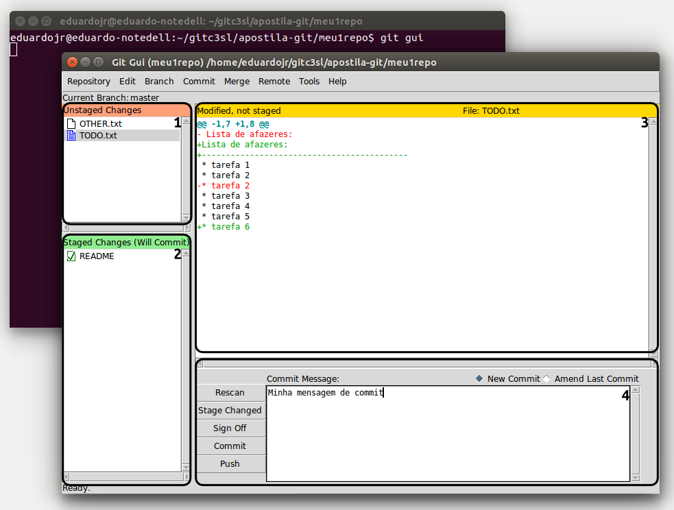
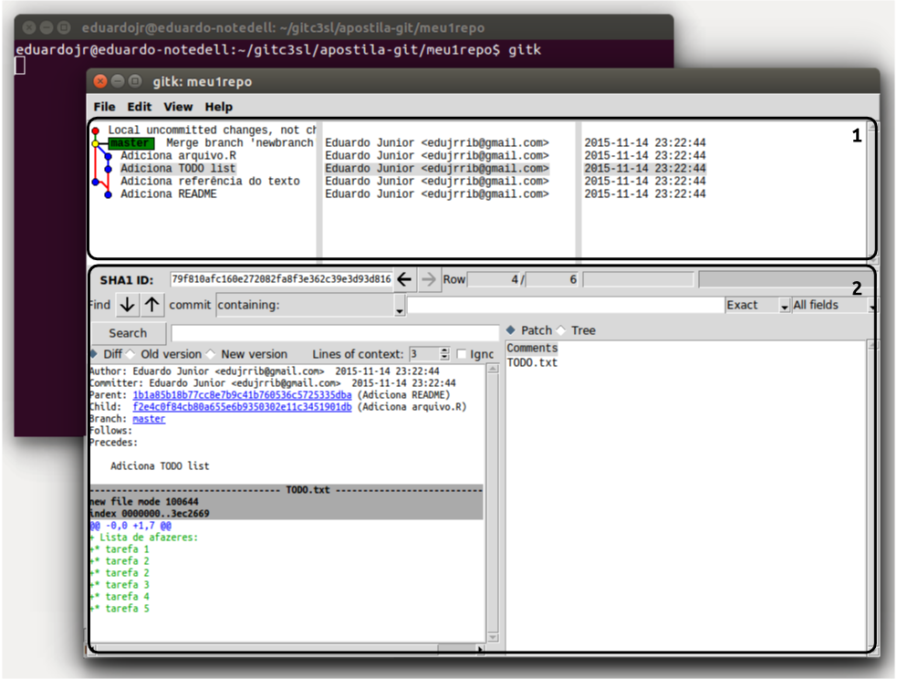
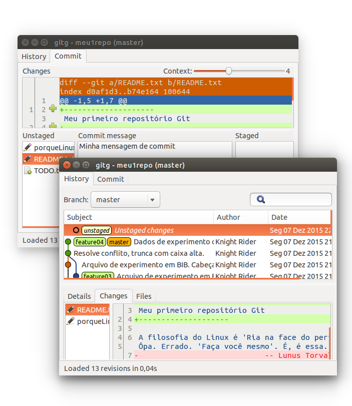
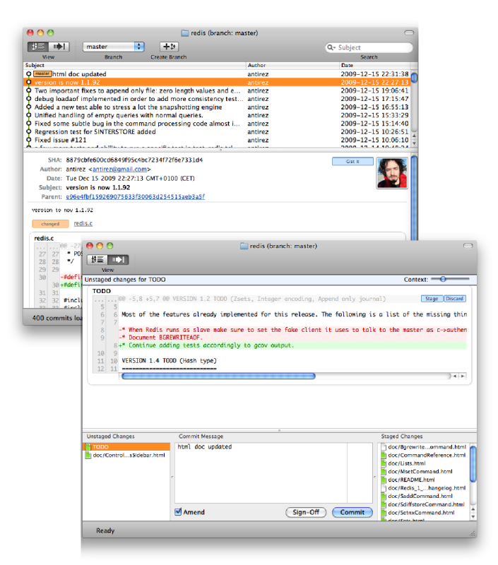
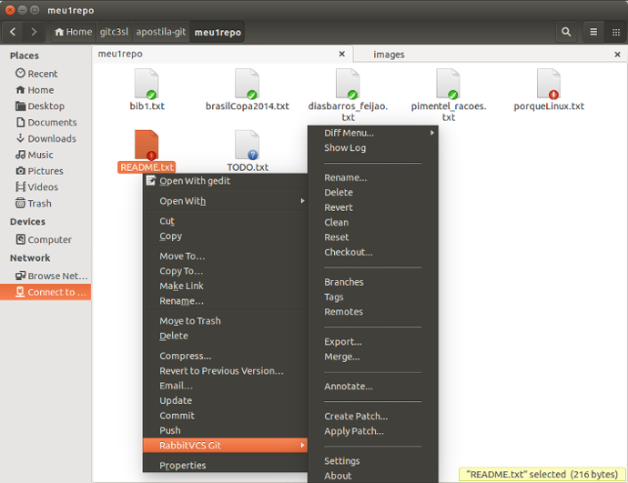
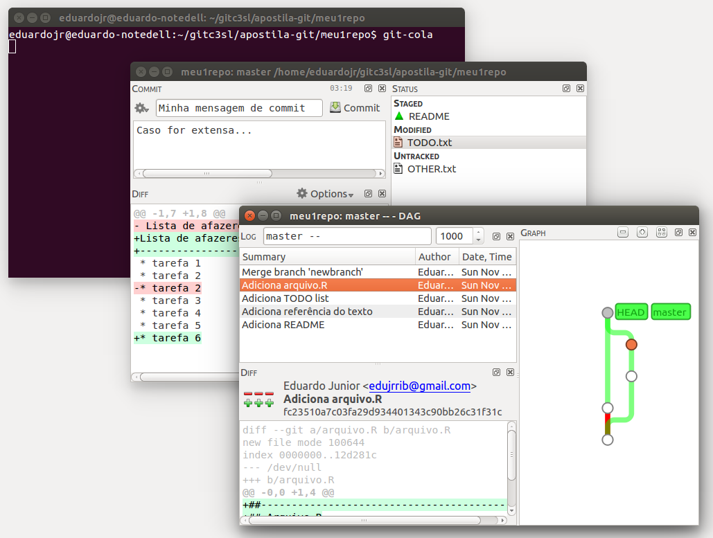

```{r, include=FALSE}
library(knitr)
opts_chunk$set(comment = NA)
```

\chapter{Ferramentas gráficas}

No Git, todo o gerenciamento do projeto é realizado via 
*CLI (Command line interface)*, linhas de comando interpretadas, geralmente 
pelo *bash*. Isso confere um maior controle e segurança nas ações realizadas, 
mas em muitas situações os comandos e *outputs* Git não se apresentam de 
forma tão amigável, seja pela difícil memorização ou pela interatividade 
limitada.

Os comandos mais usuais como `git add`e `git commit` se tornam simples,
pois mesmo para um usuário iniciante eles fazem parte do cotidiano em
um projeto sob versionamento Git. Porém, algumas situações não ocorrem
com frequência, como por exemplo voltar a versão de um arquivo ou do
repositório requerem comandos que são pouco utilizados e para realizá-las 
é necessário a consulta de algum material. Outra situação em que 
a utilização dos comandos é dificultada, ocorre em projetos grandes, uma vez que 
muitos arquivos são alterados simultaneamente. Neste caso o procedimento de *commit* 
se torna trabalhoso, pois é necessário listar todos os arquivos que fazem 
parte de um *commit* no commando `git add`. Uma última situação exemplo 
em que o uso de *CLI* não parece satisfatório é na comparação de arquivos, 
já usamos o comando `git diff` no capítulo 3 e o *output* deste comando 
foi de simples visualização, mas em arquivos grandes (com muitas linhas) 
a navegação para verificar as alterações do arquivo não é tão amigável. Para
facilitar essas e outras situações surgem as *GUI's (Graphical User 
Interfaces)*, interfaces gráficas para o usuário incorporar comandos
Git em *widgets*(botões, caixas de texto etc.) dispostos em uma janela
gráfica de seu sistema operacional.

Neste capítulo apresentamos as principais *GUI's* para projetos Git em
diferentes plataformas, sistemas UNIX, Mac OS X e Windows. Seccionamos
em dois conjuntos de interfaces. O primeiro chamado de **Interfaces
Git** refere-se às ferramentas para alterações e visualizações de
arquivos no repositório a fim de facilitar as atividades cotidianas. Já o
segundo, **Interfaces de comparação**, representam as que objetivam
facilitar a visualização e edição de arquivos com base em suas
diferentes versões. Detalhes de download, instalação e exemplos da
utilização destas interfaces no fluxo de trabalho de um projeto são descritos.

# Interfaces Git #

Neste material chamaremos de **Interfaces GIT** as *GUI's* para gestão 
de um repositório. Estas facilitam a utilização das principais 
instruções **Git** (`git add`, `git commit`, `git push`, `git pull`), 
visualização dos arquivos e alterações no repositório.

## git-gui ##

\begin{wrapfigure}{r}{0.3\textwidth}
  \vspace{-1cm}
  \begin{center}
    \includegraphics[width=3cm]{./images/gitgui-logo.pdf}
  \end{center}
  \caption{Logo usada para a \texttt{git-gui}, também é uma das logos do
  próprio GIT}
\end{wrapfigure}

Baseada em *Tcl/Tk*, a *GUI* chamada `git gui` é mantida como projeto
independente do Git, mas as versões estáveis são distribuídas junto com
o programa principal, portanto não é necessário o download e
instalação. A interface é voltada para realizar alterações no
repositório, desde as mais simples como *commitar* arquivos até as mais 
específicas como voltar estágios ou reescrever o último *commit* (muito 
útil quando notamos erros de gramática logo após a submissão). Nesta 
seção abordaremos apenas as alterações mais comuns no repositório.

A `git gui` no Windows, pode ser aberta pelo menu iniciar. Nesta
plataforma, ao instalar o Git (conforme visto no capítulo 2), optamos
pelos componentes **git BASH** e **git GUI**. Assim estas aplicações
ficam disponíveis para uso. Em sistemas UNIX, a interface pode ser
instalada via terminal, também apresentada no capítulo 2:

```{r, engine="bash", eval=FALSE}
## Instalando a git gui
sudo apt-get install git-gui

```

Ainda em sistemas Unix podemos criar um *alias* (criar ou editar
adequadamente um arquivo em */usr/share/applications*) para que a `git
gui` fique listada junto às aplicações do sistema. Porém, de forma geral,
independente da plataforma de trabalho, a `git gui` pode ser iniciada a
partir de um terminal `bash`, com o comando:

```{r, engine="bash", eval=FALSE}
git gui
```

Para exemplificar a utilização desta interface vamos alterar alguns
arquivos do repositório `meu1repo` criado no capítulo 3.

```{r, include=FALSE}
## Temporariamente usando o meu1repo do arquivo git_tuto
rmarkdown::render("git_tuto.Rmd")
```

```{r, engine="bash", echo=-c(1,2)}
cd meu1repo/

## Destaca título no README
sed -i "2i\--------------------" README.txt
sed -i "1i\--------------------" README.txt

## Destaca título no porqueLinux
sed -i "2i\--------------------" porqueLinux.txt
sed -i "1i\--------------------" porqueLinux.txt

## Corrige nome do autor citado
sed -i "s/Lunus/Linus/g" README.txt

## Cria um novo arquivo TODO.txt
echo "
Lista de afazeres:
--------------------
* tarefa 1
* tarefa 2
* tarefa 3" > TODO.txt

```

Agora visualizando o estado do repositório após nossas modificações,
ainda via terminal:

```{r, engine="bash", echo=-c(1,2)}
cd meu1repo/

git status    
```

A partir daqui poderíamos seguir o fluxo de gestão de versões via
terminal, apresentado no capítulo 3. Mas faremos isso agora via
interface `git gui`.

<!--    -->
<!-- FIGURA: Inteface `git gui` -->

\begin{figure}
  \begin{center}
    \includegraphics{./images/git-gui1}
  \end{center}
  \caption{\textit{Screenshot} da execução do programa \texttt{git-gui}}
  \label{fig:gitgui}
\end{figure}

A interface `git gui` se apresenta de forma simples, o que facilita sua
utilização. Na figura \ref{fig:gitgui} detacamos as quatro áreas que
compreendem a interface. Na primeira porção temos listados os arquivos
presentes no *working directory*, os arquivos criados aparecem com ícone
em branco e os modificados com linhas em azul, aqui a interface
implementa interativamente o comando `git add`, pois ao clicar no ícone
de um arquivo ele é automaticamente adicionado a *staging area*. Na
segunda parte são listados os arquivos na *staging area* com ícone de
*check mark*. Na terceira parte temos a implementação do comando `git
diff` para qualquer arquivo selecionado. Com destaque de cores, a
interface apresenta em vermelho as deleções e em verde as adições. Por
fim temos no canto inferior direito a área para escrever *commits* com
botões para submissão de ação. Um detalhe importante do `git gui` é que
o idioma do sistema operacional é verificado para sua construção, ou
seja, os botões da interface na figura \ref{fig:gitgui} são *push*,
*commit*, *sign off*, etc, pois o idioma do sistema operacional em que
essa interface foi executada é o inglês. Para outros idiomas as
mensagens podem sofrer alterações.

Além das quatro áreas principais da interface, que facilitam
interativamente atividades como `git status`, `git diff`, `git add`,
`git commit` e `git push`, temos mais implementações no menu da
interface para procedimentos não cotidianos. Essas implementações podem
ser acessadas com um simples clique e são auto-explicativas.

## gitk ##

\begin{wrapfigure}{r}{0.3\textwidth}
  \vspace{-1cm}
  \begin{center}
    \includegraphics[width=3cm]{./images/gitk-logo.pdf}
  \end{center}
  \caption{Logo da interface \texttt{gitk}, símbolos de supressão e
  adição são característicos das logos GIT}
\end{wrapfigure}

Pioneira dentre as interfaces gráficas, `gitk` foi a primeira
*GUI* implementada. Também escrita em *Tcl/Tk*, esta *GUI*
tem como objetivo a apresentação do histórico de um projeto. A `gitk`
é incorporada ao principal repositório do Git, portanto nas instalações
completas, esta interface fica disponível sem ser necessário
download e instalação. Nesta seção apresentamos a `gitk`, detalhando a
disposição dos elementos nesta interface que se mostra muito útil na
visualização de projetos.

A `gitk` trabalha em conjunto com a `git gui`. Em `git gui` podemos
fazer alterações de forma rápida e visual nos arquivos que estão na
*staging area* e *working directory*, porém para visualizar o histórico
completo de *commits* com ramificações, marcações e demais detalhes,
recorremos à `gitk`, uma prova disso é que no menu da `git gui` temos um atalho
para a `gitk` \menu{Repository > Visualize History}. Essa interface se
mostra muito útil também como ferramenta de aprendizagem Git, uma vez
que visualizar de forma gráfica as alterações que os comandos realizados
causam no projeto, torna mais fácil a compreensão dos mesmos.

`gitk`, assim como a `git gui` pode ser chamada atráves da linha de
comando:

```{r, engine="bash", eval=FALSE}
gitk
```

Para exemplificar a disposição dos elementos nesta interface, seguimos
com as alterações feitas na seção anterior, lembrando que temos todas as
alterações já realizadas no capítulo 3 e ainda duas modificações e uma
inclusão de arquivo não *commitados*. Visualizando a interface `gitk`
chamada neste estado do repositório temos:

<!--    -->
<!-- FIGURA: Inteface `gitk` -->
\begin{figure}
  \begin{center}
    \includegraphics{./images/gitk1}
  \end{center}
  \caption{\textit{Screenshot} da execução do programa \texttt{gitk}}
  \label{fig:gitk}
\end{figure}

Perceba na figura \ref{fig:gitk} que esta interface é mais completa
do que a `git gui` no que diz respeito à informação. Dividida em apenas
duas partes, a `gitk` apresenta na primeira todo o histórico do projeto,
comtempla uma implementação visual e agradável do comando `git log --graph`. No
gráfico apresentado na parte superior, as bolinhas em azul representam
*commits* passados, a de amarelo indica o estado atual do repositório e
em vermelho são as modificações no *working directory*. Ao lado estão os
autores dos respectivos *commits* e o momento em que foram feitos. Na
parte inferior da interface temos o detalhamento do *commit* selecionado
na parte superior. As informações contidas aqui vão desde
identificador do *commit* (*SHA1 ID*), diferença das modificações
referenciadas com relação ao estado anterior do
repositório até a listagem dos arquivos atingidos pelo *commit*
selecionado.

Além da excelente apresentação visual do repositório Git, a interface 
`gitk` também permite algumas alterações. Clicando com o botão direito de 
seu *mouse* em qualquer *commit* listado, podemos criar *tags*, reverter o 
repositório neste estado, criar um ramo a partir do *commit* dentre outras 
opções possíveis atráves da interface.

## Outras Interfaces ##

### gitg e gitx ###

Estas duas interfaces tentam juntar em uma única as opções
proporcionadas pela `git gui` e pela `gitk`. Os layouts e as propostas
são similares, a diferença está na portabilidade.  A `gitg` é
implementada em *GTk+* e está disponível para sistemas UNIX e a `gitx`
foi implementada para Mac OS seguindo o estilo de aplicativos deste
sistema operacional. De forma geral não há detalhes a serem repassados
sobre estas interfaces uma vez que as possibilidades já foram listadas
nas seções sobre `git gui` e `gitk`

<!--  -->
<!-- FIGURA: Interface `gitg` -->

\begin{figure}
  \begin{center}
    \includegraphics{./images/gitg}
  \end{center}
  \caption{\textit{Screenshot} da execução do programa \texttt{gitg}}
  \label{fig:gitg}
\end{figure}

<!--  -->
<!-- FIGURA: Interface `gitx` -->

\begin{figure}
  \begin{center}
    \includegraphics{./images/gitx}
  \end{center}
  \caption{\textit{Screenshot} do programa \texttt{gitx}}
  \label{fig:gitx}
\end{figure}

### RabbitVCS ###

*RabbitVCS* é uma coleção de ferramentas gráficas para navegadores de
 arquivos do sistema LINUX que permitem o acesso simples e direto aos
 sistemas de controle de versão Git e/ou Subversion. Não se caracteriza
 como interface, porém altera a visualização no navegador de arquivos de
 diretórios sob versionamento, além de dispor de ações implementadas
 nas opções do menu quando pressionado o botão direito do mouse.

<!--  -->
<!-- FIGURA: Navegador *Nautilus* com uso do `RabbitVCS` -->

\begin{landscape}
\begin{figure}
  \begin{center}
    \includegraphics{./images/rabbitvcs}
  \end{center}
  \caption{\textit{Screenshot} do Navegador \textit{Nautilus} com uso do 
  \texttt{RabbitVCS}}
  \label{fig:rabbit}
\end{figure}
\end{landscape}

Na figura \ref{fig:rabbit} temos o *screenshot* do repositório
`meu1repo` no navegor de arquivos `nautilus` (padrão do sistema Ubuntu
14.04). Perceba que com essa interface os ícones de arquivos e pastas no
navegador ganham destaque com um outro pequeno ícone na parte
inferior. Estes pequenos ícones indicam o estado do arquivo sem precisar
recorrer ao terminal, ou seja, temos um `git status` no próprio
navegador de arquivos. Além disso `RabbitVCS` complementa o menu de
opções acessados com o botão direito do mouse. Essas opções são completas, 
vão desde *commits*, criação de *branchs* e *tags*, reverter 
o estado do repositório, até atualizar com a versão remota, entre outras.
 
### git-cola ###

Esta também é uma interface alternativa que se destaca por ser completa
e portável (disponível para sistema LINUX, Windows e Mac). Implementada
em *python*, a `git-cola` é uma alternativa à `git gui` e contém
praticamente os mesmos elementos para alterações no repositório. Como a
`git gui` se auxilia da `gitk` para visualização, a `git-cola` também
tem uma interface de apoio, chamada de `git-dag` que vem instalado junto
ao `git-cola`.

<!--  -->
<!-- FIGURA: Interface `git-cola` e `git-dag` -->

\begin{figure}
  \begin{center}
    \includegraphics{./images/git-cola}
  \end{center}
  \caption{\textit{Screenshot} dos programas \texttt{git-cola} e
  \texttt{git-dag}}
  \label{fig:git-dag}
\end{figure}

Perceba pela figura \ref{fig:git-dag} que as opções das interfaces são
similares as apresentadas em `git gui` e `gitk`. As interfaces
`git-cola` e `git-dag` se destacam pela fácil manipulação do layout
exibido, além de deixar a interface mais intuitiva
possível. Como destaque em implementação de funcionalidade Git, a
`git-cola` se sobressai com relação à `git gui` na possibilidade de
execução do comando `git rebase` via interface.

### Plugins e extensões para editores ###

Muitas vezes é inconveniente trabalhar com códigos fonte em um editor e
ter que abrir um terminal *bash* em outra janela do sistema operacional
para verificar o sistema de versionamento, realizar commits,
etc. Felizmente alguns editores possuem um sistema **Git** integrado,
seja por meio de *plugins* adicionais instalados ou pela opção nativa do
editor.

Destacamos aqui dois editores, comumente utilizados pela comunidade
estatística, que possuem os comandos **Git** intergrado à sua
interface. São eles, o `emacs`, o qual temos as opções de *buffers* no
editor onde podemos abrir uma instância *shell* e executar os comandos
**Git** junto com o desenvolvimento do código fonte. Além disso uma
extensão poderosa chamada `magit`\footnote{Informações em
\url{http://magit.vc/}} está disponível e em desenvolvimento para o uso
no `emacs`, esta extensão proporciona opções de comandos e
visualização em um *buffer* do editor que facilita o trabalho de
versionamento. Outro editor também muito utilizado em Estatística,
talvez o mais utilizado pela comunidade, é o RStudio que também
implementa em sua interface vários comandos, assim como as interfaces
anteriormente descritas e tarefas não triviais, uma chamada do
terminal *Shell* é possível dentro do aplicativo. Devido ao seu grande
uso, o RStudio terá uma seção específica onde as diversas
ferramentas serão exploradas, com exemplos e ilustrações voltadas para a
comunidade estatística.

# Interfaces de comparação #

Uma das principais vantagens do **Git** é a possibilidade de trabalho
paralelo por dois ou mais usuários ou por ramos de desenvolvimento. E
como qualquer desenvolvimento paralelo, desejamos ao final do trabalho,
mesclar as contribuições realizadas lado a lado. Como vimos no capítulo
3 isso é feito através do comando `git merge ramo_desenvolvimento` para
ramos locais e `git push origin` quando estamos
trabalhando em equipe e as contribuições são enviadas para um servidor
remoto, capítulo 4. Porém, quando a mesma porção de um mesmo arquivo é
alterada em duas instâncias distintas (ramos diferentes, usuários
diferentes etc.)  ocorrem conflitos e vimos como o **Git** os sinaliza
para que possamos resolvê-los.  Nesta seção mostraremos como as
interfaces gráficas dedicadas à resolução de conflitos na mesclagem e à
visualização da diferença de arquivos em estados diferentes do
repositório podem nos auxiliar.

\begin{wrapfigure}{r}{0.3\textwidth}
  \vspace{-1cm}
  \begin{center}
    \includegraphics[width=3cm]{./images/meld-logo.pdf}
  \end{center}
  \caption{Logo do aplicativo \texttt{meld}, não há descrições sobre o
  seu significado, mas nos parece representar mistura, como mistura de
  arquivos}
\end{wrapfigure}

Há vários programas que objetiva a comparação visualmente agradável de
arquivos. Aqui iremos abordar o programa `meld`, que é multiplataforma
*open source* e tem várias facilidades implementadas, porém outras
alternativas serão indicadas, e devido à equidade de objetivos todos os
comentários feitos para o `meld` podem ser adotadas para os demais.

O programa `meld` é implementado em *python* e se denomina como "uma
ferramenta de diferenciação e mesclagem voltada para desenvolvedores", o
programa pode ser baixado para as plataformas UNIX, Mac OS X e
Windows atráves do endereço <http://meldmerge.org/>. O `meld` não é uma
ferramenta específica para o Git, como as apresentadas na seção
\ref{interfaces-git}, porém é permitido e será usado para comparar versões de
arquivos ou repositórios, mas vamos começar apresentando o `meld` como 
programa independente.

Inicializando o programa, sua tela inicial deverá ser similar a
apresentada na figura \ref{fig:meld1}, aqui estamos utilizando um
sistema operacional Ubuntu 14.04. A partir daí podemos escolher
quaisquer dois (ou três) arquivos ou diretórios para comparação.

\begin{figure}
  \begin{center}
    \includegraphics{./images/meld1}
  \end{center}
  \caption{\textit{Screenshot} do tela inicial do programa \textit{meld}
  \texttt{RabbitVCS}}
  \label{fig:meld1}
\end{figure}

A partir da escolha, o `meld` apresenta os arquivos ou diretórios lado a
lado para comparação e destaca as porções dentro dos arquivos que estão
discordantes. A figura \ref{fig:meld2} apresenta a comparação de dois
arquivos, que salvamos como `README_v1` e `README_v2` (relembrando os
velhos tempos antes de conhecermos o **Git**).

\begin{figure}
  \begin{center}
    \includegraphics{./images/meld2}
  \end{center}
  \caption{\textit{Screenshot} de comparaçao de arquivos com programa
  \textit{meld} 
  \texttt{RabbitVCS}}
  \label{fig:meld2}
\end{figure}

Com isso já podemos notar onde utilizar esta ferramenta no fluxo de
trabalho de um projeto sob versionamento. Vamos então voltar ao nosso
projeto `meu1repo`, iniciado no capítulo 3 e alterado na seção
\ref{interfaces-git} (Interfaces Git). As alterações realizadas não
foram salvas, então podemos visualizá-las no `meld`. A inicialização do
programa pode ser feita via linha de comando `git difftool`, só temos 
que informar o programa a ser utilizado com a opção
`-t` (abreviação de `--tool`). Nos sistemas UNIX, o programa pode ser 
lançado apenas atráves do nome `meld`.

```{r, engine="bash", eval=FALSE}
## Compara o arquivo README (UNIX)
git difftool -t meld README.md
```

Para utilização em sistemas Windows, programas externos ao Git devem 
ser informados no arquivo de configuração (`.gitconfig`). Abaixo 
configuramos, via linha de comando, este arquivo para usarmos o `meld` 
como ferramenta de comparação - `difftool`, tanto para usuários Unix
como usuários Windows:

```{r, engine="bash", eval=FALSE}
## Define localmente o meld como ferramenta padrão de diff
##-------------------------------------------
## Unix.
git config diff.tool meld

##-------------------------------------------
### Windows.
git config diff.tool meld
git config difftool.meld.cmd '"path/Meld.exe" $LOCAL $REMOTE'

```

\noindent 
onde `path` é o caminho para o arquivo executável do programa `meld`. 
`$LOCAL` representa o arquivo na sua versão local e `$REMOTE` na sua 
versão remota. Assim o programa pode ser lançado apenas com o 
comando:

```{r, engine="bash", eval=FALSE}
## Compara o arquivo README (WINDOWS)
git difftool README.md
```

\begin{figure}
  \begin{center}
    \includegraphics{./images/meld3}
  \end{center}
  \caption{\textit{Screenshot} do programa \textit{meld} utilizado como
  \texttt{difftool} para o arquivo \texttt{README.txt}
  \texttt{RabbitVCS}}
  \label{fig:meld3}
\end{figure}

Na figura \ref{fig:meld3} temos o _screenshot_ do programa após executado
o `difftool`. Nesta figura temos a mesma informação trazida pelas
interfaces onde implementam o comando `git diff`, porém aqui podemos
alterar os arquivos exibidos atráves das flechas nas bordas (levando ou
trazendo as contribuições) ou mesmo editando pela interface. Isso pode
ser útil caso necessite desfazer parcialmente um *commit*, ou seja,
parte das alterações de uma versão anterior seria mantida e parte
alterada.

Contudo, a maior necessidade das ferramentas de comparação não está no
seu uso como `difftools`, mas sim como `mergetools`. Já vimos no
capítulo 3 que há momentos em que a mesclagem de ramos gera conflitos e
estes eram resolvidos abrindo e editando os arquivos conflitantes. Porém
com o `meld` ou outras interfaces de comparação, podemos realizar a
resolução de conflitos via interface.

Para exemplificar a utilidade na resolução de conflitos na mesclagem,
vamos marcar as alterações já feitas no `meu1repo` e criar um novo
*branch* alterando os mesmos arquivos a fim de gerar conflito.

```{r, engine="bash", echo=-c(1,2)}
cd meu1repo/

## Criando um novo ramo para desenvolvimento
git branch feature05

## Registrando as alterações no ramo master
git add .
git commit -m "Adiciona TODO e corrige README"

## Indo para o ramo feature05
git checkout feature05

##-------------------------------------------
## Alterando README para induzir conflito

## Destaca título no README
sed -i "2i\####################" README.txt
sed -i "1i\####################" README.txt

## Corrige citações, de "'" para """
sed -i "s/'/\"/g" README.txt

##-------------------------------------------

## Registrando as alterações no ramo feature05
git add .
git commit -m "Adiciona lista de coisas a se fazer"
```

Tentando incorporar as contribuições realizadas acima, do ramo `changes`
para o ramo `master` obtemos:

```{r, engine="bash", eval=FALSE}
## Retorna ao ramo principal
git checkout master

## Tentativa de mesclagem
git merge feature05

```

```{r, warning=FALSE, echo=FALSE}
x <- system("cd meu1repo && git checkout master && git merge feature05",
            intern=TRUE)
cat(paste(x, collapse="\n"))

```

E agora, ao invés de editarmos o arquivo em conflito, vamos utilizar a
ferramenta `meld` para resolver os conflitos. Para isso, execute o 
seguinte comando no terminal:

```{r, engine="bash", eval=FALSE}
## Lançando a interface `meld` para resolução de conflitos
git mergetool -t meld

```

\begin{landscape}
\begin{figure}
  \begin{center}
    \includegraphics{./images/meld4}
  \end{center}
  \caption{\textit{Screenshot} do programa \texttt{meld} utilizado como
  \texttt{difftool} para o arquivo \texttt{README.txt}
  \texttt{RabbitVCS}}
  \label{fig:meld4}
\end{figure}
\end{landscape}

Na figura \ref{fig:meld4} temos a janela do programa `meld` quando usado
para resolução de conflito, conforme comando descrito anteriormente. São
apresentados três versões lado a lado de cada arquivo em conflito: à
direita temos a versão `LOCAL`, com o estado do arquivo no ramo atual; à
esquerda o `REMOTE`, que representa a versão com as alterações a serem
mescladas e; finalmente na porção central temos o `BASE`, com o conteúdo
de uma versão anterior comum a ambos. Assim como apresentado na figura
\ref{fig:meld3}, em que o `meld` foi utilizado como `difftool`, podemos
(e neste caso devemos) editar um arquivo o `BASE`, exibido na porção
central do aplicativo. Este arquivo será o definitivo ao fim da
mesclagem, nele podemos incluir as contribuições apresentadas no que
batizamos de `LOCAL` e `REMOTE`. Isso facilita a resolução de conflitos,
pois podemos ver as contribuições lado a lado e decidir como deverá
ficar o arquivo definitivo.

Após a edição do arquivo, o processo de mesclagem pode continuar
normalmente. Abaixo concluímos o processo via linha de comando:

```{r, engine="bash", eval=FALSE}
## Verificando o estado do repositório
git status

```

```sh
On branch master
All conflicts fixed but you are still merging.
  (use "git commit" to conclude merge)

Changes to be committed:

	modified:   README.txt

Untracked files:
  (use "git add <file>..." to include in what will be committed)

	README.txt.orig

```

```{r, engine="bash", echo=-c(1,2)}
cd meu1repo/ \ sed -i "s/=//g" README.txt
git add README.txt
    
## Conclui a mesclagem com a mensagem de commit curta
git commit -m "Resolve conflito via meld"
```

Para resolucão de conflitos via alguma ferramenta gráfica com o comando
`git mergetool`, o **Git** gera arquivos de _backup_ com extensão
`.orig`. Perceba no _output_ gerado pelo `git status` que estes armazenam o
conteúdo de cada arquivo em conflito com as porções conflitantes. 
É recomendável não versionar estes arquivos de _backup_. Podemos 
então simplesmente exluí-los ou ignorá-los após a mesclagem adicionando 
arquivos com esta extensão no `.gitignore`. Outra forma de manter seu 
repositório sem os arquivos _backup_ é configurando sua `mergetool` para 
não armazená-los, ou seja, que a própria ferramenta os descarte quando a 
mesclagem for bem sucedida. Isso pode ser configurado com:

```{r, engine="bash", eval=FALSE}
## Configura a ferramenta de merge para não criar os backups
git config --global mergetool.keepBackup false

```

O procedimento de conflito simulado acima foi resolvido utilizando o
programa `meld`, com os comandos definidos para os sistemas baseados no
kernel LINUX. Ainda a chamada do programa foi realizada através da opção `-t` (ou `--tool`). Porém podemos definir o `meld` como
ferramenta padrão para resolução de `merge`, assim como foi feito para
a ferramenta de comparação (`difftool`). Abaixo configuramos o `meld`
também como `mergetool`, para sistemas Unix e Windows.

```{r, engine="bash", eval=FALSE}

## Configura localmente meld como ferramenta padrão de merge
##-------------------------------------------
## Unix
git config merge.tool meld

##-------------------------------------------
## Windows
git config merge.tool meld
git config merge.meld.cmd '"path/Meld.exe" $LOCAL $BASE $REMOTE --output=$MERGED'

```

Para Windows deve-se informar o caminho para o arquivo executável,
`path`, além de definir as três versões que serão exibidas `$LOCAL`,
`$BASE` e `$REMOTE` conforme vimos na figura \ref{fig:meld4}. Ainda a
opção `--output=$MERGED`, para informar que o arquivo a ser editado será
sobrescrito sob a versão `$MERGED`, que é criada automaticamente
pelo Git quando há conflitos. 

Alternativamente pode-se editar o arquivo `.gitconfig` com as mesmas
informações passadas ao comando `git config`. Para verificar como
altera-se esse arquivo, abra-o após avaliar os comandos descritos. Ainda, 
se desejado que essas opções sejam válidas para todos os projetos Git de
seu computador, a opção `--global` em `git config` pode ser
utilizada. Assim, quando avaliados os comandos `git mergetool` e `git difftool`, o programa `meld` será lançado automaticamente.

Com isso, já temos nosso **Git** devidamente configurado para utilizar o
programada `meld` e já observamos sua relevância quando se trabalha com
arquivos versionados. Mas ainda, apresentamos somente uma das várias
interfaces que se dispõem a facilitar a visualização de diferenças e
mesclagem de arquivos. Podemos citar as interfaces
`kdiff3`\footnote{Disponível para \textit{download} em
\url{http://kdiff3.sourceforge.net/}} e 
`P4Merge`\footnote{Disponível para \textit{download} em
\url{https://www.perforce.com/product/components/perforce-visual-merge-and-diff-tools}}, 
como outras interfaces de comparação bastante utilizadas em projetos
versionados. Em geral, todos estes programas seguem o mesmo estilo de
exbição de arquivos que o `meld` e as configurações para torná-los
programas de `mergetool` e `difftoll` padrão são as mesmas.

É importante salientar que as ferramentas gráficas apresentadas neste
capítulo não substituem totalmente os comandos via terminal, mas seu uso
em conjunto com estes facilitam o fluxo de trabalho adotado em um
projeto sob versionamento.

<!-- Exclui o repositório criado para exemplicação -->
```{r, engine = "bash", include = FALSE, eval = FALSE}
sudo rm -R meu1repo
```
